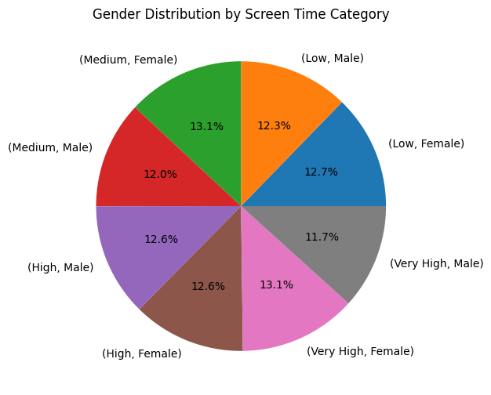
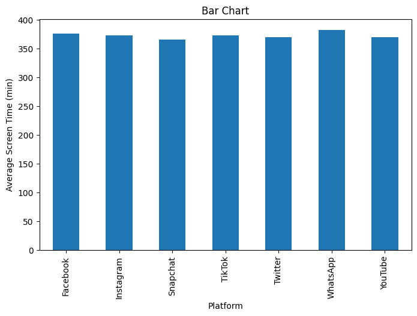
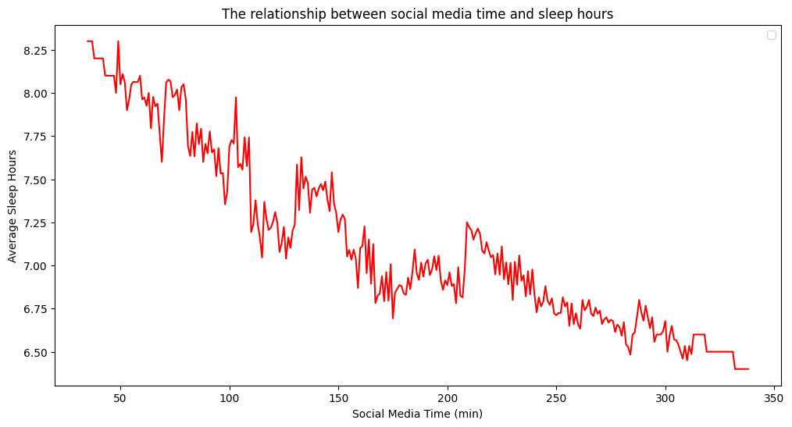
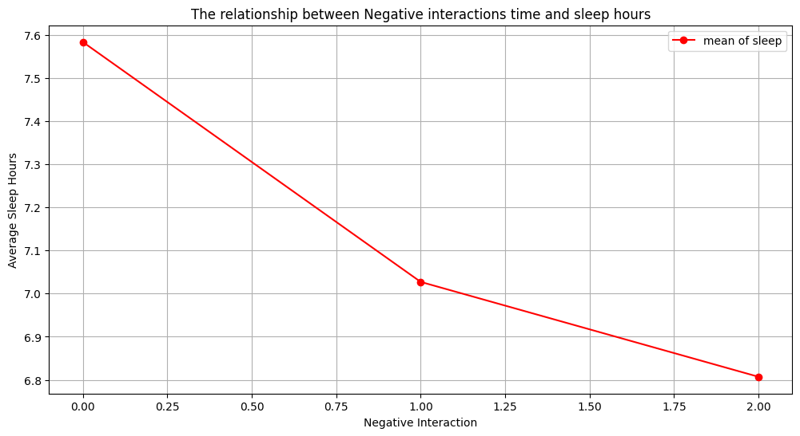
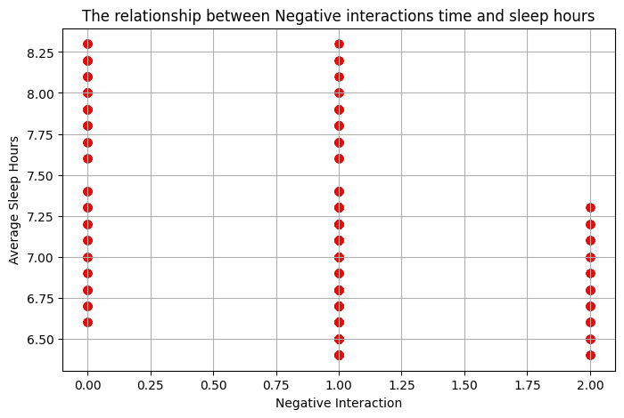
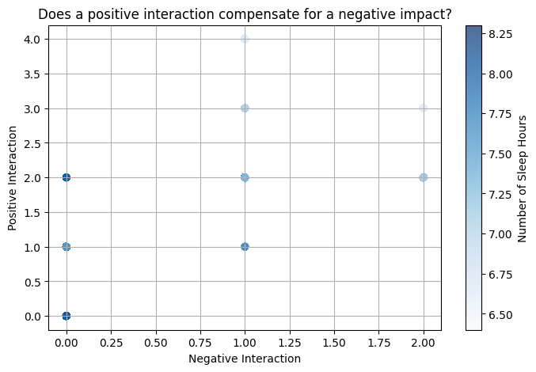
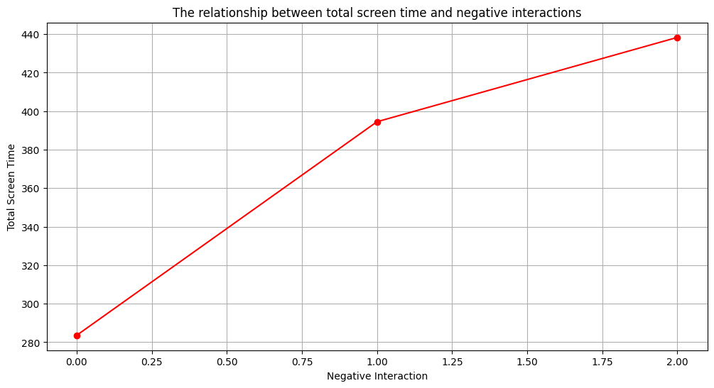
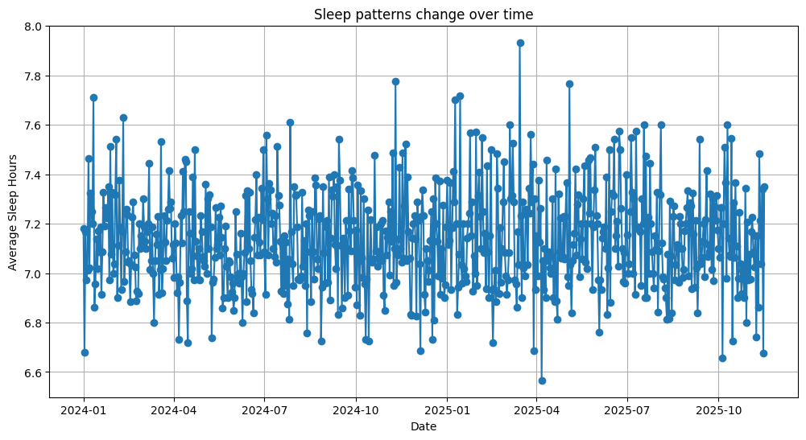
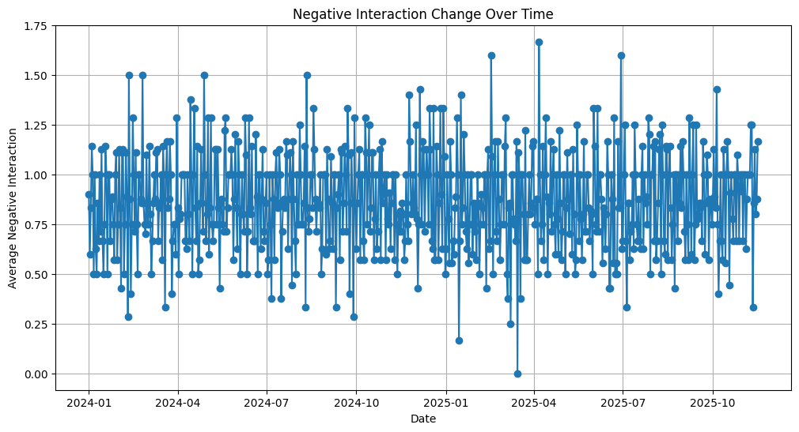

Social Media & Mental Health Indicators Analysis

By: Maudah Abdullah Alahmari

Overview | نظرة عامة

This project explores how social media usage impacts sleep duration, interaction quality, and overall well-being. By analyzing digital behavior patterns, the study highlights how certain platforms and usage habits may correlate with mental health indicators.

يستكشف هذا المشروع تأثير استخدام وسائل التواصل الاجتماعي على ساعات النوم وجودة التفاعلات والصحة العامة. من خلال تحليل الأنماط الرقمية، يسلط المشروع الضوء على العلاقة بين العادات الرقمية وبعض المؤشرات المرتبطة بالصحة النفسية.

Dataset | بيانات المشروع

The dataset contains daily records of users' digital behavior to analyze wellness indicators.

يحتوي هذا الملف على بيانات يومية لسلوك المستخدمين على وسائل التواصل ومؤشرات الرفاهية.

Columns used in the dataset | الأعمدة في الداتاسيت:

person_name
age
date
gender
platform
daily_screen_time_min
social_media_time_min
negative_interactions_count
positive_interactions_count
sleep_hours

Key Features | أبرز نقاط المشروع

• Data cleaning & handling missing values

• Feature engineering (age & screen time grouping)

• Descriptive and visual analysis

• Time-series insights

• Behavioral patterns and correlation study

• تنظيف البيانات والتعامل مع القيم الناقصة

• إنشاء متغيرات جديدة لتحسين التحليل

• تحليلات ورسوم بيانية توضيحية

• تحليل زمني لتتبع التغيرات اليومية

• دراسة الترابط بين السلوك الرقمي والرفاهية

Tools & Technologies | الأدوات المستخدمة

Python — Pandas — NumPy — Matplotlib — Seaborn — EDA — Time Series — Correlation Analysis

Key Findings | أهم النتائج

• Higher social media usage is linked to reduced sleep duration

• TikTok users show more negative interactions

• Gender has no major influence on screen time

• Age & platform type shape behavioral outcomes

• ارتفاع استخدام السوشيال ميديا يرتبط بانخفاض ساعات النوم

• مستخدمو TikTok معرضون لتفاعلات سلبية أكثر

• لا يظهر اختلاف ملحوظ حسب الجنس

• العمر ونوع المنصة يؤثران على نتائج الاستخدام

## Visualizations | الرسوم البيانية

 1️⃣ Average Screen Time by Gender

---

 2️⃣ Gender Distribution by Screen Time Category

---

 3️⃣ Average Screen Time by Platform

---

 4️⃣ Social Media Time vs Sleep Hours

---

 5️⃣ Negative Interactions vs Sleep Hours

---

 6️⃣ Scatter Plot: Negative Interactions vs Sleep

---

 7️⃣ Positive vs Negative Interactions (Color-Coded by Sleep Hours)

---

 8️⃣ Screen Time vs Negative Interactions

---

 9️⃣ Sleep Patterns Over Time

---

 🔟 Negative Interactions Over Time

Conclusion | الخلاصة

This analysis shows a direct connection between digital behavior and wellness indicators. Increased social media usage, especially on highly engaging platforms like TikTok, correlates with shorter sleep and higher negative interactions. Age and platform choice appear more influential than gender in shaping experiences and outcomes.

يوضح هذا التحليل وجود علاقة بين السلوك الرقمي ومؤشرات الصحة النفسية. فالزيادة في الاستخدام، خصوصًا في المنصات ذات التفاعل العالي مثل TikTok، ترتبط بانخفاض ساعات النوم وزيادة التعرض للتفاعلات السلبية. ويتضح أن العمر ونوع
المنصة لهما تأثير أكبر من الجنس على النتائج السلوكية.

How to Run the Project | كيفية تشغيل المشروع

Download or clone the repository

Open the .ipynb file in Google Colab or Jupyter Notebook

Install required libraries if needed

Run cells step-by-step to reproduce the analysis

Future Improvements | أفكار للتطوير

• Build a prediction model to estimate sleep hours

• Expand the dataset for stronger conclusions

• Create a dashboard on Power BI or Tableau

• تطوير نموذج تنبؤ لساعات النوم

• توسيع البيانات لتعزيز دقة النتائج

• إنشاء لوحة تفاعلية باستخدام Power BI أو Tableau

🤝 Contact | للتواصل
Maudah Abdullah Alahmari
📫 (Email:AlahmariMwdh@gmail.com / LinkedIn: https://www.linkedin.com/in/maudah-alahmari-7b1475342?utm_source=share&utm_campaign=share_via&utm_content=profile&utm_medium=ios_app)

